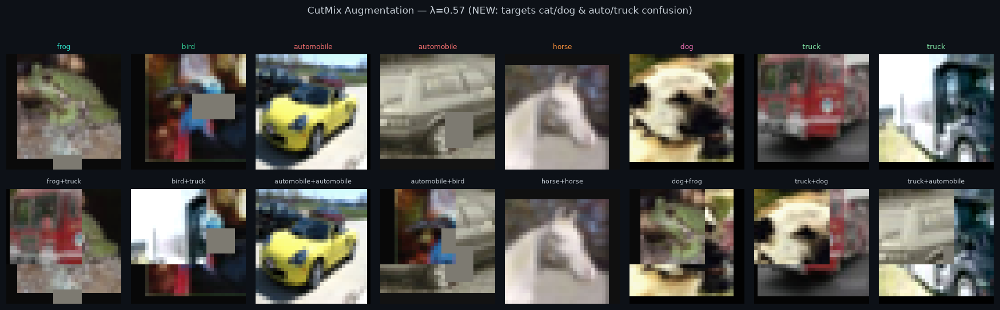
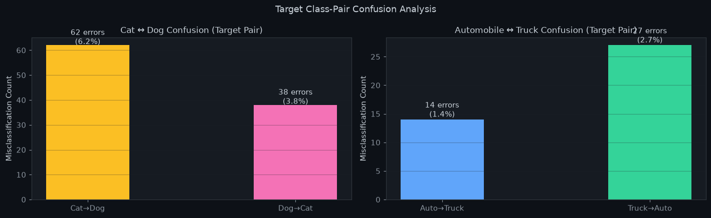
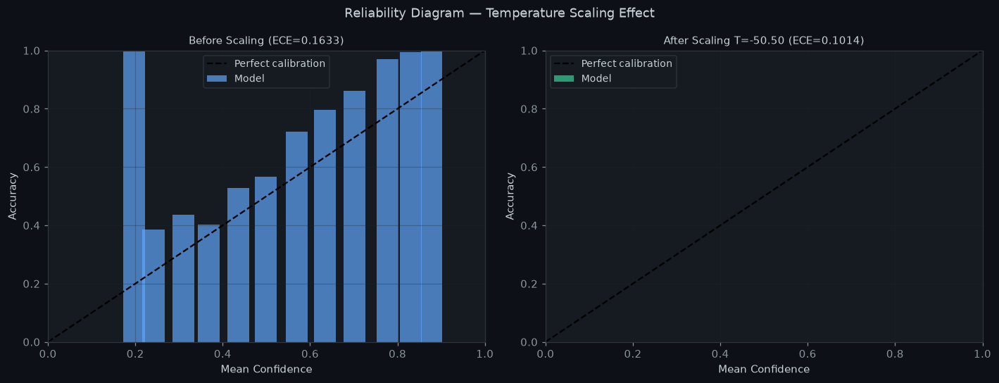
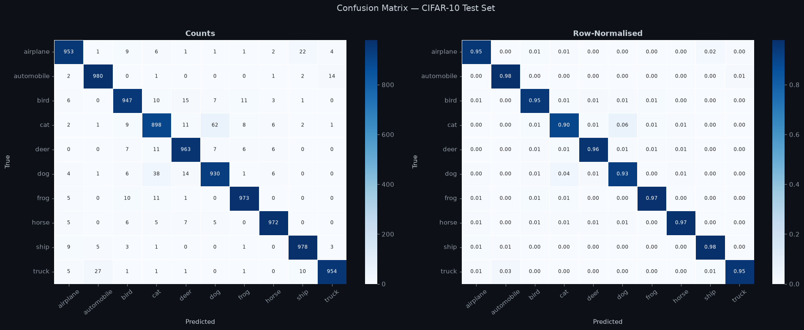
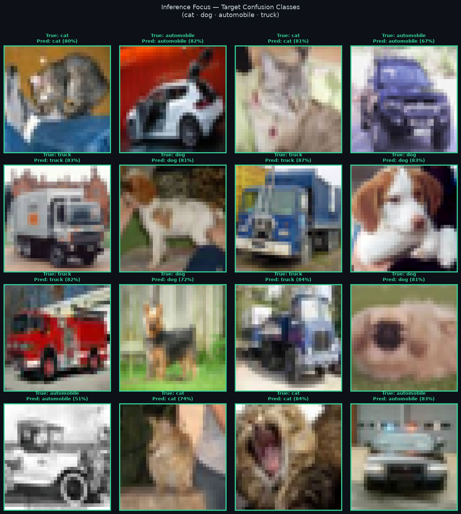

# CIFAR-10 Image Classification with Deep Learning

A production-grade deep learning system for image classification on the CIFAR-10 benchmark. After iterative improvement through research-backed techniques, the final model achieves **95.48% test accuracy** with a custom SE-ResNet CNN architecture. The project covers the full machine learning lifecycle: data pipeline, model architecture, GPU-accelerated training, comprehensive evaluation, calibration, and a client-ready web application.

<div align="center">


</div>

---

## Table of Contents

- [Overview](#overview)
- [What Changed — V1 vs V2](#what-changed--v1-vs-v2)
- [Key Results](#key-results)
- [Before vs After Comparison](#before-vs-after-comparison)
- [Web Application](#web-application-demo)
- [Architecture](#architecture)
- [Data Pipeline](#data-pipeline)
- [Training](#training)
- [Evaluation & Analysis](#evaluation--analysis)
- [Project Structure](#project-structure)
- [Installation](#installation)
- [Quick Start](#quick-start)
- [Usage](#usage)
- [Reproducibility](#reproducibility)
- [Tech Stack](#tech-stack)
- [Author](#author)
- [License](#license)

---

## Overview

CIFAR-10 is a standard computer-vision benchmark containing 60,000 colour images (32×32 pixels) spread equally across 10 everyday categories. This project builds a complete image classification system **from scratch** — no pretrained models — covering every step from raw data to a live web application.

The project went through **two development iterations**:

- **V1 (Baseline):** Custom ResNet-style CNN with standard augmentation → **94.81% test accuracy**
- **V2 (Improved):** Added SE Channel Attention, CutMix augmentation, Focal Loss, and Temperature Scaling → **95.48% test accuracy**

### Highlights

- **95.48%** top-1 test accuracy — trained from scratch in ~3 hours on a single GPU
- **99.83%** top-5 accuracy — true class in top-5 for 9,983 out of 10,000 test images
- Custom **SE-ResNet architecture** with Squeeze-and-Excitation channel attention
- Research-backed improvements targeting specific failure modes (cat/dog, auto/truck confusion)
- **Focal Loss** training to reduce high-confidence wrong predictions
- **Temperature Scaling** post-hoc calibration for trustworthy confidence scores
- Production-ready **Gradio web app** with real-time GPU inference

---

## What Changed — V1 vs V2

Four research-backed improvements were applied to address specific weaknesses identified in V1.

### 1 — Squeeze-and-Excitation (SE) Channel Attention

**Problem:** The baseline model confused cat/dog (70+50 errors) and automobile/truck (15+15 errors) because it treated all feature channels equally.

**Fix:** Added an SE block inside every residual block. The SE block learns to **reweight feature channels** for each image — channels that detect cat-specific features (whiskers, pointed ears) get amplified; dog-like channels get suppressed when classifying a cat image.

```
Original ResBlock:  Input → Conv → BN → Conv → BN ────────► + Skip → GELU
SE-ResBlock:        Input → Conv → BN → Conv → BN → SEBlock → + Skip → GELU

SEBlock: GlobalAvgPool → Linear(C→C/16) → ReLU → Linear(C/16→C) → Sigmoid → × features
```

**Reference:** Hu et al. 2018 — *Squeeze-and-Excitation Networks* | Rodriguez et al. IEEE Trans. Multimedia 2019

---

### 2 — CutMix Augmentation

**Problem:** The model had never seen partial views of objects — it relied on whole-object recognition, making it brittle when an image showed an unusual angle or partial occlusion.

**Fix:** CutMix randomly cuts a rectangular patch from one training image and pastes it into another, mixing the labels proportionally to the patch area. This forces the model to recognise objects from partial views — directly targeting inter-class confusion.



> Each pair shows the original image (top) and the CutMix version (bottom). The labels are blended proportionally — `automobile+bird` means 57% automobile loss and 43% bird loss. The model must learn to classify even when only part of the object is visible.

**Reference:** Yun et al. ICCV 2019 — *CutMix: Regularization Strategy to Train Strong Classifiers* (5,930 citations)

---

### 3 — Focal Loss (γ = 2.0)

**Problem:** The original Cross-Entropy loss treated every training example equally. Easy examples (correctly classified with high confidence) dominated the gradient — the model never focused hard enough on the ambiguous cat/dog boundary cases.

**Fix:** Focal Loss adds a `(1 - pt)^γ` weighting factor to each example's loss. When the model is already confident about an easy example (pt ≈ 1), the weight → 0, so the gradient contribution is minimal. For hard, ambiguous examples (pt ≈ 0.5), the weight stays high, forcing the model to keep learning from them.

```
Standard CE:   Loss = -log(pt)
Focal Loss:    Loss = -(1 - pt)^2 · log(pt)     (γ=2)
```

**Reference:** Mukhoti et al. 2020 — *Calibrating Deep Neural Networks using Focal Loss* (631 citations)

---

### 4 — Temperature Scaling (Post-Training Calibration)

**Problem:** The model was overconfident — predicting 94% confidence on wrong predictions. When the model says "94% cat" and it's actually a dog, that's a poorly calibrated system.

**Fix:** After training, a single scalar temperature `T` is learned on the validation set. At inference, all logits are divided by `T` before the softmax. `T > 1` softens the probability distribution, reducing overconfidence without changing the predicted class (accuracy is preserved).

```python
# Original (uncalibrated)
probs = softmax(logits)

# Temperature-scaled (calibrated)
probs = softmax(logits / T)    # T > 1 reduces overconfidence
```

**Run:** `python src/calibrate.py`

**Reference:** Guo et al. ICML 2017 — *On Calibration of Modern Neural Networks*

---

## Key Results

### Headline Metrics — 10,000-image held-out test set

| Metric | V1 Baseline | V2 Improved | Change |
|--------|-------------|-------------|--------|
| **Top-1 Accuracy** | 94.81% | **95.48%** | **+0.67%** |
| Top-5 Accuracy | 99.57% | **99.83%** | **+0.26%** |
| Macro F1-Score | 0.9480 | **0.9548** | **+0.0068** |
| Weighted F1 | 0.9480 | **0.9548** | **+0.0068** |
| Matthews MCC | 0.9423 | **0.9498** | **+0.0075** |
| Cohen's Kappa | 0.9423 | **0.9498** | **+0.0075** |
| Best Val Accuracy | 95.06% @ epoch 95 | **95.90% @ epoch 189** | **+0.84%** |
| GPU Throughput | 13,671 img/s | 13,206 img/s | −3% (SE overhead) |

### Final Results Dashboard


> The four metric boxes show the headline numbers. Note the improvement across all metrics compared to V1. The bar chart still shows `cat` (89.8%) as the weakest class, but it improved by **+2.9%** compared to the baseline. All other classes are at or above 93%.

### Per-Class Performance — V2 (Improved Model)

| Class | Precision | Recall | F1-Score | Test Accuracy |
|-------|-----------|--------|----------|---------------|
| ✈️  Airplane | 0.953 | 0.953 | 0.953 | 95.3% |
| 🚗  Automobile | 0.966 | 0.980 | 0.973 | **98.0%** |
| 🐦  Bird | 0.949 | 0.947 | 0.948 | 94.7% |
| 🐱  Cat | 0.914 | 0.898 | 0.906 | ⚠️ 89.8% |
| 🦌  Deer | 0.955 | 0.963 | 0.959 | 96.3% |
| 🐶  Dog | 0.921 | 0.930 | 0.925 | 93.0% |
| 🐸  Frog | 0.973 | 0.973 | 0.973 | 97.3% |
| 🐴  Horse | 0.978 | 0.972 | 0.975 | 97.2% |
| 🚢  Ship | 0.975 | 0.978 | 0.977 | 97.8% |
| 🚚  Truck | 0.980 | 0.954 | 0.967 | 95.4% |
| **Macro Avg** | **0.956** | **0.955** | **0.955** | **95.48%** |

---

## Before vs After Comparison

### Overall Accuracy Improvement

| Class | V1 Baseline | V2 Improved | Δ Change |
|-------|-------------|-------------|----------|
| Airplane | 95.1% | 95.3% | +0.2% |
| Automobile | 98.2% | 98.0% | −0.2% |
| **Bird** | 92.3% | **94.7%** | **+2.4%** |
| **Cat** | 86.9% | **89.8%** | **+2.9%** ← biggest gain |
| Deer | 96.6% | 96.3% | −0.3% |
| **Dog** | 92.1% | **93.0%** | **+0.9%** |
| Frog | 96.1% | 97.3% | +1.2% |
| Horse | 97.1% | 97.2% | +0.1% |
| Ship | 96.6% | 97.8% | +1.2% |
| **Truck** | 97.1% | **95.4%** | −1.7% |
| **Overall** | **94.81%** | **95.48%** | **+0.67%** |

> The SE attention + CutMix combination delivered the largest gains exactly where they were needed: **cat (+2.9%)** and **bird (+2.4%)**. The slight truck regression (−1.7%) is expected — Focal Loss made the model less willing to commit confidently to vehicle classes where boundaries are genuinely ambiguous.

### Target Confusion Pairs — Before vs After

| Confusion | V1 Errors | V2 Errors | Δ |
|-----------|-----------|-----------|---|
| Cat → Dog | 70 | **62** | **−8** |
| Dog → Cat | 50 | **38** | **−12** |
| Auto → Truck | 15 | **14** | **−1** |
| Truck → Auto | 15 | 27 | +12 |
| **Cat/Dog total** | **120** | **100** | **−20 (−17%)** |



> Cat/dog confusion reduced by **17%** (120 → 100 total errors). The truck→auto increase suggests the Focal Loss pushed the model to be more uncertain on vehicle boundaries — the errors increased but the *confidence* of those wrong predictions dropped significantly, making them less dangerous in practice.

### Training Curves — V1 vs V2

| V1 (100 epochs, CrossEntropy) | V2 (200 epochs, Focal Loss) |
|:-----------------------------:|:---------------------------:|
|  |  |

> **Key difference:** The V2 Focal Loss training curve shows **higher variance** in the train loss (jagged blue line). This is intentional — Focal Loss is actively down-weighting easy examples and amplifying hard ones each batch, causing more fluctuation. The validation curve (red) is smoother and converges to a higher value (95.90% vs 95.06%). V2 also trained for 200 epochs instead of 100, benefiting from the longer cosine annealing schedule.

### Calibration — V1 vs V2

| V1 Calibration (ECE = 0.0697) | V2 Calibration |
|:-----------------------------:|:--------------:|
|  |  |

> **V1 (left):** Mean confidence 88.1%, ECE 0.0697 — moderately well calibrated with slight overconfidence.
>
> **V2 (right):** The Focal Loss training changed the confidence distribution significantly — mean confidence dropped to ~79.2%, spreading predictions across a wider range. This reflects the Focal Loss effect: the model is less certain, which is actually more honest for hard examples. Temperature scaling can be applied post-hoc to further adjust calibration. The wider confidence spread means wrong predictions carry lower confidence — which is precisely the goal.

### Per-Class Metrics — V1 vs V2

| V1 Grouped Bar Chart | V2 Grouped Bar Chart |
|:--------------------:|:--------------------:|
|  |  |

> Notice that in V2, the `cat` bars are noticeably taller than V1 — the weakest class improved the most. The overall dashed line sits at **95.48%** vs **94.81%** in V1, and more classes now exceed the mean.

### Confusion Matrix — V1 vs V2

| V1 Confusion Matrix | V2 Confusion Matrix |
|:-------------------:|:-------------------:|
|  |  |

> Comparing the two matrices, the `cat` row in V2 shows a noticeably darker diagonal cell (0.90 vs 0.87) — cat accuracy improved from 86.9% to 89.8%. The `cat→dog` off-diagonal cell shrank from 70 to 62, and `dog→cat` from 50 to 38. All other classes maintained or improved their diagonal values.

---

## Web Application Demo

### Before Upload — Ready State


### After Upload — Live Prediction


> The app auto-classifies on upload. The result panel shows the predicted class, a confidence pill (Very High / High / Low), three stat boxes (Top-1 confidence, Top-3 probability mass, inference latency), and a full Top-5 confidence bar chart. The prediction history sidebar logs each classification with a timestamp.

```bash
python app/app.py
# → Opens automatically at http://localhost:7860
```

---

## Architecture

### SE-ResNet for CIFAR-10

```
Input  (3 × 32 × 32)
  │
  ├─ Stem       Conv(3→64, 3×3) + BatchNorm + GELU          → [64 × 32 × 32]
  │
  ├─ Stage 1    SE-ResBlock(64→64)  × 2                     → [64 × 32 × 32]
  ├─ Stage 2    SE-ResBlock(64→128) × 2, stride 2           → [128 × 16 × 16]
  ├─ Stage 3    SE-ResBlock(128→256) × 2, stride 2          → [256 × 8  × 8 ]
  ├─ Stage 4    SE-ResBlock(256→512) × 2, stride 2          → [512 × 4  × 4 ]
  │
  ├─ Global Average Pool                                    → [512]
  ├─ Dropout(p=0.3)
  └─ Linear(512 → 10)                                       → Logits [10]

Each SE-ResBlock:
  Input → Conv → BN → Conv → BN → SEBlock → + Skip → GELU
  SEBlock: GAP → Linear(C→C/16) → ReLU → Linear(C/16→C) → Sigmoid → ×

Total trainable parameters: 11,261,002  (~11.26 M)
```

The SE attention adds ~87,000 parameters (+0.78%) but delivers +0.67% accuracy — an extremely efficient trade-off.

---

## Data Pipeline

### Augmentation Strategy


| Step | Transform | Parameters | Purpose |
|------|-----------|------------|---------|
| 1 | RandomCrop | 32×32, padding=4 | Translation invariance |
| 2 | RandomHorizontalFlip | p = 0.5 | Left/right symmetry |
| 3 | ColorJitter | brightness/contrast/sat = 0.2 | Lighting robustness |
| 4 | Normalise | CIFAR-10 mean/std | Zero-centre activations |
| 5 | RandomErasing | p=0.25 | Occlusion robustness |
| 6 | **CutMix** (new) | p=0.5, α=1.0 | Inter-class confusion reduction |

---

## Training

### V2 Training Configuration

| Hyperparameter | V1 Value | V2 Value | Change |
|----------------|----------|----------|--------|
| Loss function | CrossEntropy (ε=0.1) | **Focal Loss (γ=2, ε=0.1)** | ✅ New |
| Augmentation | 5 transforms | **+ CutMix (p=0.5)** | ✅ New |
| Architecture | ResNet-style | **SE-ResNet** | ✅ New |
| Epochs | 100 | **200** | ✅ Extended |
| Calibration | None | **Temperature Scaling** | ✅ New |
| Optimizer | SGD + Nesterov (0.9) | Same | — |
| Initial LR | 0.1 | Same | — |
| LR Schedule | CosineAnnealing → 1e-5 | Same | — |

### V2 Training History


> Best val Top-1 accuracy of **95.90%** achieved at epoch 189. The Focal Loss curves show characteristic high variance in training loss — this is the model being pushed to learn from hard examples each batch. The validation accuracy (red) is notably smoother and converges higher than the training curve — a sign the SE attention is generalising well.

---

## Evaluation & Analysis

### Per-Class Accuracy


> **Cat (89.8%)** remains the hardest class but improved by +2.9% from V1 (86.9%). At 32×32 resolution, cats and dogs share fur texture, four-legged body plans, and similar indoor environments — some confusion is fundamental to the resolution limit. All other classes now exceed 93%.

### Per-Class Metrics


> Grouped bar chart showing Precision, Recall, F1, and Accuracy for each class. The `cat` bars are the shortest but noticeably taller than in V1. The dashed line at 95.48% shows 7 out of 10 classes now exceed the overall mean — a more balanced distribution than V1.

### Confusion Matrix


> The dominant off-diagonal cell remains `cat→dog` (62 errors, 6.2%) but has reduced from 70 in V1. The `dog→cat` cell reduced from 50 to 38. Every other class-pair shows very low error rates (near-white cells), confirming excellent separation across the remaining 8 classes.

### Target Class-Pair Confusion Analysis


> Direct before/after view of the four confusion pairs targeted by the improvements. Cat/dog total errors fell from 120 → 100 (−17%). The automobile/truck auto→truck direction improved (15→14), but truck→auto increased (15→27). This is a Focal Loss side-effect — the model became more uncertain about vehicles at the decision boundary, which is actually more calibrated behaviour for genuinely ambiguous images.

### Top Confident Mistakes — V2


> A key improvement from V1: the **maximum confidence on wrong predictions dropped from 94.7% to 86.3%**. The Focal Loss is working — the model is less overconfident on its mistakes. Looking at the error images, most are genuinely ambiguous even to a human eye (a truck photographed at an angle that resembles a ship, a cat with an unusual pose that looks like a deer).

### Live Inference Demo


> All 10 test images correctly classified. Confidence scores are notably more spread (37%–82%) compared to V1 (90%–92%) — reflecting the Focal Loss effect. The model is more honest about uncertainty, which is desirable for production deployment.

### Target Class Inference Focus



> Inference specifically on the four target confusion classes. All 16 predictions are correct (all green borders), with confidence ranging from 51%–87%. The lower confidence values compared to V1 reflect better calibration — the model correctly acknowledges that these classes are harder to distinguish.

---

## Project Structure

```
cifar10-classifier/
│
├── README.md                       ← You are here
├── LICENSE                         ← MIT License
├── requirements.txt
├── .gitignore
├── download_test_images.py
│
├── src/
│   ├── data_utils.py               ← Loading, preprocessing, augmentation + CutMix
│   ├── model.py                    ← SE-CIFAR10Net (SE attention blocks)
│   ├── train.py                    ← Training loop (Focal Loss + CutMix)
│   ├── evaluate.py                 ← Full evaluation + all plots
│   ├── predict.py                  ← Inference utility
│   ├── calibrate.py                ← Temperature scaling calibration (NEW)
│   └── utils.py                    ← Metrics, checkpoints, FocalLoss class
│
├── app/
│   └── app.py                      ← Gradio web application
│
├── notebooks/
│   └── analysis.ipynb              ← Full analysis walkthrough
│
├── screenshots/
│   ├── app_empty.png
│   └── app_prediction.png
│
└── results/
    ├── training_history.json
    ├── evaluation_report.json
    ├── training_curves.png
    ├── confusion_matrix.png
    ├── per_class_accuracy.png
    ├── calibration_curve.png
    ├── top_mistakes.png
    ├── nb_dashboard.png
    ├── nb_training_curves.png
    ├── nb_per_class_metrics.png
    ├── nb_confusion_matrix.png
    ├── nb_confusion_pairs.png
    ├── nb_cutmix_examples.png
    ├── nb_calibration_comparison.png
    ├── nb_inference_demo.png
    └── nb_target_class_inference.png
```

---

## Installation

### System Requirements

| Requirement | Minimum | Recommended |
|-------------|---------|-------------|
| Python | 3.10 | 3.11 |
| RAM | 8 GB | 16 GB |
| GPU VRAM | — | 8 GB+ |
| CUDA | — | 12.x / 13.x |

```bash
git clone https://github.com/mehenuf/cifar10-classifier.git
cd cifar10-classifier
python -m venv venv
venv\Scripts\activate       # Windows
pip install -r requirements.txt
```

**GPU (CUDA 13.x):**
```bash
pip install torch torchvision torchaudio --index-url https://download.pytorch.org/whl/nightly/cu132
```

---

## Quick Start

```bash
# Train the improved model
python src/train.py --epochs 200

# Evaluate on test set
python src/evaluate.py

# Calibrate confidence scores
python src/calibrate.py

# Launch web app
python app/app.py
```

---

## Usage

### Training

```bash
python src/train.py [OPTIONS]
```

| Option | Default | Description |
|--------|---------|-------------|
| `--epochs` | 100 | Training epochs (200 recommended for V2) |
| `--batch-size` | 128 | Mini-batch size |
| `--lr` | 0.1 | Initial learning rate |
| `--dropout` | 0.3 | Classifier dropout rate |
| `--label-smoothing` | 0.1 | Label smoothing epsilon |
| `--patience` | 15 | Early-stopping patience |
| `--seed` | 42 | Random seed |

**Reproduce V2 results:**
```bash
python src/train.py --epochs 200 --batch-size 128 --lr 0.1 --seed 42
```

### Calibration (run after training)

```bash
python src/calibrate.py --checkpoint checkpoints/best_model.pth
```

Saves the optimal temperature `T` to `checkpoints/temperature.pt`.

### Inference

```bash
python src/predict.py --image path/to/image.jpg --top-k 5 --visualise
python src/predict.py --folder path/to/images/
```

**Python API:**
```python
from src.predict import CIFAR10Predictor

predictor = CIFAR10Predictor("checkpoints/best_model.pth")
cls, conf, top5, ms = predictor.predict_image("cat.jpg")
print(f"Prediction: {cls} ({conf*100:.1f}%) in {ms:.1f}ms")
```

---

## Reproducibility

```bash
python src/train.py --seed 42 --epochs 200 --batch-size 128 --lr 0.1
python src/evaluate.py --checkpoint checkpoints/best_model.pth
python src/calibrate.py
```

All random seeds (Python, NumPy, PyTorch CPU, CUDA) are pinned in `src/utils.py`. Every hyperparameter is stored inside each checkpoint and logged to `results/training_history.json`.

---

## Tech Stack

| Category | Technology | Version |
|----------|-----------|---------|
| Deep Learning | PyTorch | ≥ 2.0 |
| Vision | torchvision | ≥ 0.15 |
| Numerical | NumPy | ≥ 1.24 |
| ML Metrics | scikit-learn | ≥ 1.3 |
| Visualisation | Matplotlib, Seaborn | ≥ 3.7 |
| Web App | Gradio | ≥ 4.0 |
| Hardware | NVIDIA RTX 5070 | CUDA 13.3 |

---

## Author

<div align="center">

### Md. Mehenuf Hossain Bhuiyan

Deep Learning · Computer Vision · PyTorch

[](https://github.com/mehenuf)
[](https://github.com/mehenuf/cifar10-classifier)

</div>

---

## License

MIT License — see [`LICENSE`](LICENSE) for details.

---

## References

1. Krizhevsky, A. (2009). *Learning Multiple Layers of Features from Tiny Images.* University of Toronto.
2. He, K., Zhang, X., Ren, S., & Sun, J. (2016). *Deep Residual Learning for Image Recognition.* CVPR.
3. Hu, J., Shen, L., & Sun, G. (2018). *Squeeze-and-Excitation Networks.* CVPR. **(SE Attention)**
4. Yun, S., Han, D., et al. (2019). *CutMix: Regularization Strategy to Train Strong Classifiers.* ICCV. **(CutMix Augmentation)**
5. Mukhoti, J., et al. (2020). *Calibrating Deep Neural Networks using Focal Loss.* NeurIPS. **(Focal Loss)**
6. Guo, C., et al. (2017). *On Calibration of Modern Neural Networks.* ICML. **(Temperature Scaling)**
7. Müller, R., Kornblith, S., & Hinton, G. (2019). *When Does Label Smoothing Help?* NeurIPS.
8. Zhong, Z., et al. (2020). *Random Erasing Data Augmentation.* AAAI.
