# CIFAR-10 Image Classification with Deep Learning

A production-grade deep learning system for image classification on the CIFAR-10 benchmark, achieving **94.81% test accuracy** with a custom ResNet-style convolutional neural network. The project covers the full machine learning lifecycle: data pipeline, model architecture, GPU-accelerated training, comprehensive evaluation, and a client-ready web application for real-time inference.

<div align="center">


</div>

---

## Table of Contents

- [Overview](#overview)
- [Key Results](#key-results)
- [Web Application](#web-application-demo)
- [Architecture](#architecture)
- [Data Pipeline](#data-pipeline)
- [Training](#training)
- [Evaluation & Analysis](#evaluation--analysis)
- [Project Structure](#project-structure)
- [Installation](#installation)
- [Quick Start](#quick-start)
- [Usage](#usage)
- [Reproducibility](#reproducibility)
- [Tech Stack](#tech-stack)
- [Author](#author)
- [License](#license)

---

## Overview

CIFAR-10 is a standard computer-vision benchmark containing 60,000 colour images (32×32 pixels) spread equally across 10 everyday categories. This project builds a complete image classification system **from scratch** — no pretrained models, no shortcuts — covering every step from raw data to a live web application.

**In plain terms:** You show the model a photo, and it tells you what's in it — airplane, car, bird, cat, deer, dog, frog, horse, ship, or truck — with a confidence score, in under a millisecond.

**Technical approach:** A custom deep neural network inspired by the ResNet family, trained with modern optimisation techniques (mixed-precision GPU training, cosine learning-rate annealing, label smoothing, and four layers of data augmentation) to maximise accuracy while keeping the model compact.

### Highlights

- **94.81%** top-1 test accuracy — trained from scratch in just 78 minutes on a single GPU
- **99.57%** top-5 accuracy — the correct class appears in the model's top-5 guesses for 9,957 out of 10,000 test images
- Custom **11.17M-parameter** ResNet-style architecture built without any pretrained weights
- Full **mixed-precision (AMP)** training — twice as fast on modern NVIDIA GPUs with no accuracy cost
- Production-ready **Gradio web app** — upload any image, get results in milliseconds
- Fully **reproducible** — every random seed is pinned, every hyperparameter is logged

---

## Key Results

### Headline Metrics — 10,000-image held-out test set

| Metric | Score | What it means |
|--------|-------|----------------|
| **Top-1 Accuracy** | **94.81%** | Correct on first guess for 9,481 out of 10,000 images |
| Top-5 Accuracy | 99.57% | True class in top-5 guesses for 9,957 out of 10,000 images |
| Macro F1-Score | 0.9480 | Balanced accuracy across all 10 classes |
| Matthews Corr Coef | 0.9423 | Overall quality score (0=random, 1=perfect) |
| Cohen's Kappa | 0.9423 | How much better than random guessing |
| ECE (Calibration) | 0.0697 | How trustworthy the confidence scores are (lower = better) |
| GPU Throughput | 13,671 images/sec | How many images classified per second |
| Best Val Accuracy | 95.06% at epoch 95 | Peak performance during training |
| Training Time | 78.4 minutes | Total time on RTX 5070 GPU |

### Final Results Dashboard

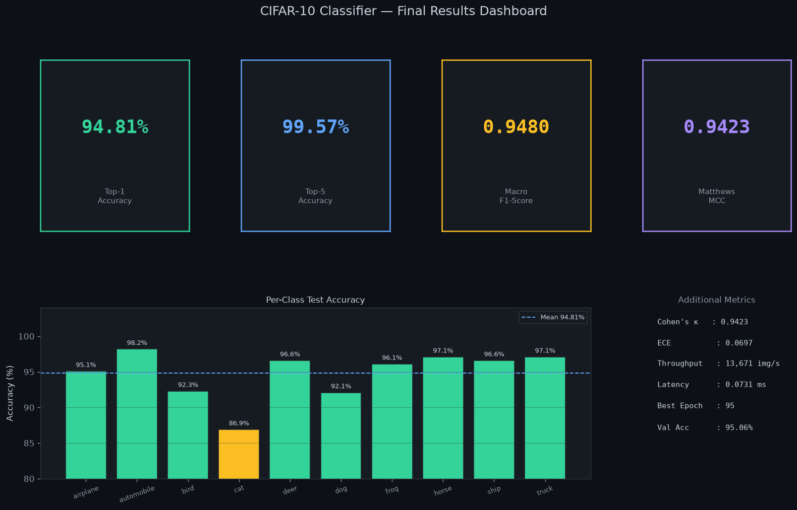

> The four metric boxes at the top show the headline numbers at a glance. The bar chart below breaks down accuracy for each of the 10 classes — green bars (≥90%) show strong performance, and the single orange bar reveals that `cat` is the hardest class to classify correctly. The table on the right lists additional technical metrics for completeness.

### Per-Class Performance

| Class | Precision | Recall | F1-Score | Test Accuracy |
|-------|-----------|--------|----------|---------------|
| ✈️  Airplane | 0.950 | 0.951 | 0.951 | 95.1% |
| 🚗  Automobile | 0.976 | 0.982 | 0.979 | **98.2%** |
| 🐦  Bird | 0.930 | 0.923 | 0.926 | 92.3% |
| 🐱  Cat | 0.898 | 0.869 | 0.883 | ⚠️ 86.9% |
| 🦌  Deer | 0.947 | 0.966 | 0.956 | 96.6% |
| 🐶  Dog | 0.903 | 0.921 | 0.912 | 92.1% |
| 🐸  Frog | 0.962 | 0.961 | 0.961 | 96.1% |
| 🐴  Horse | 0.980 | 0.971 | 0.975 | 97.1% |
| 🚢  Ship | 0.968 | 0.966 | 0.967 | 96.6% |
| 🚚  Truck | 0.967 | 0.971 | 0.969 | 97.1% |
| **Macro Avg** | **0.948** | **0.948** | **0.948** | **94.81%** |

---

## Web Application Demo

An interactive Gradio web application provides real-time GPU-accelerated inference. Upload any image and receive top-5 predictions with confidence scores, inference latency, and a live prediction history — all in a professional dark-theme UI.

### Before Upload — Ready State

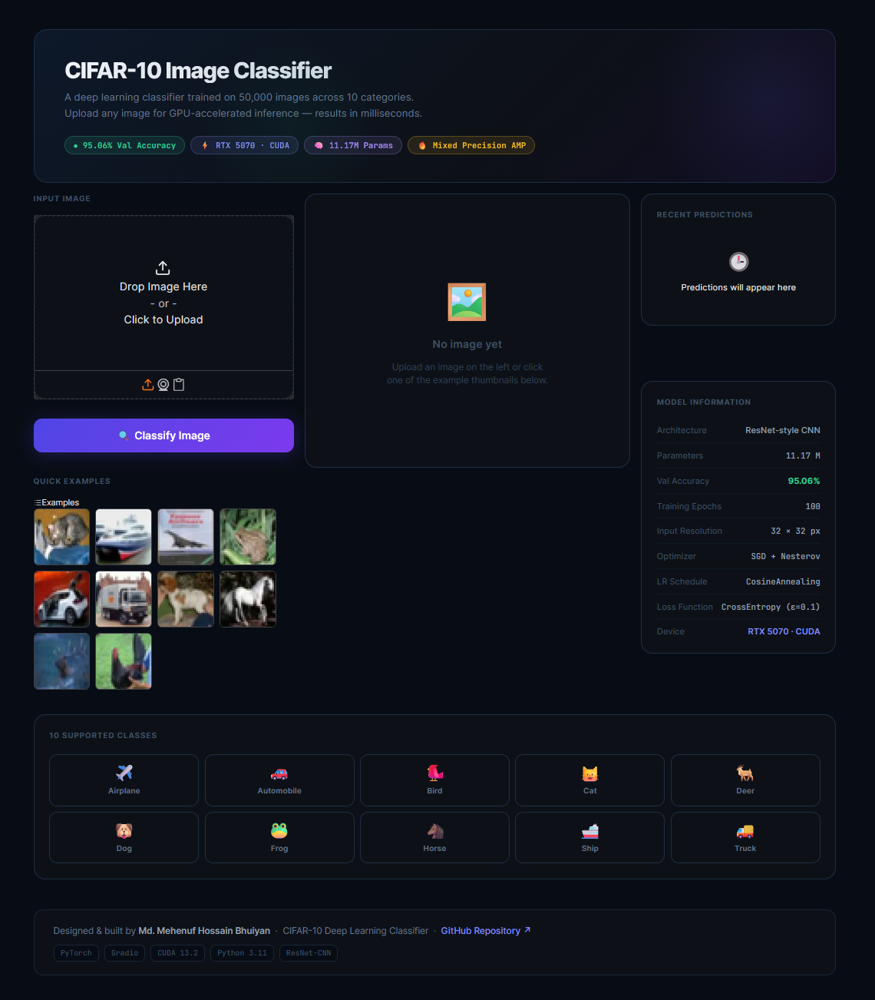

*The application on launch: a drag-and-drop upload zone on the left, a placeholder result panel in the centre, the model information sidebar on the right, and 10 clickable example images from the CIFAR-10 test set at the bottom.*

### After Upload — Live Prediction

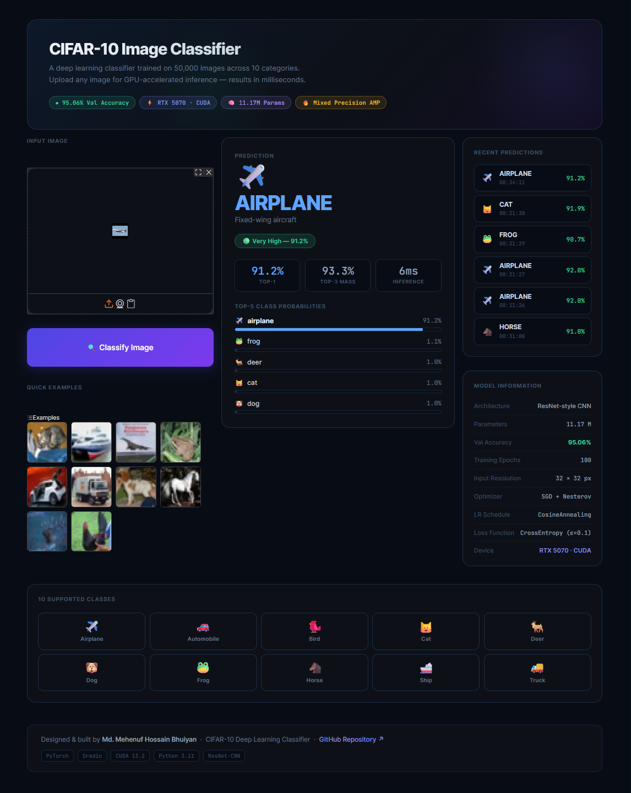

*After uploading an airplane image: the model correctly predicts **AIRPLANE** with **91.2% confidence** in just **6 milliseconds**. The result panel shows the predicted class, a "Very High" confidence badge, three stat boxes (Top-1 confidence, Top-3 probability mass, inference time), and a full Top-5 probability bar chart. The prediction history sidebar on the right automatically logs each classification with a timestamp.*

### Launch the App

```bash
python app/app.py
# → Opens automatically at http://localhost:7860
```

---

## Architecture

The model is a custom ResNet-style CNN designed and tuned specifically for CIFAR-10's 32×32 inputs — built entirely from scratch without any pretrained weights.

```
Input  (3 × 32 × 32)
  │
  ├─ Stem       Conv(3→64, 3×3)  + BatchNorm + GELU    → [64 × 32 × 32]
  │
  ├─ Stage 1    ResBlock(64→64)  × 2                   → [64 × 32 × 32]
  ├─ Stage 2    ResBlock(64→128) × 2, stride 2         → [128 × 16 × 16]
  ├─ Stage 3    ResBlock(128→256) × 2, stride 2        → [256 × 8  × 8 ]
  ├─ Stage 4    ResBlock(256→512) × 2, stride 2        → [512 × 4  × 4 ]
  │
  ├─ Global Average Pool                               → [512]
  ├─ Dropout(p=0.3)
  └─ Linear(512 → 10)                                  → Logits [10]

Total trainable parameters: 11,173,962  (~11.17 M)
```

### Parameter Distribution


> Stage 4 holds 75% of all parameters (8.39M) because it operates at the highest feature complexity (512 channels). Earlier stages are intentionally lightweight — this pyramid design lets the network learn simple low-level features (edges, colours) cheaply, and complex high-level features (object parts, shapes) with more capacity.

### Design Rationale

| Component | Choice | Plain-English Reason |
|-----------|--------|---------------------|
| Residual connections | Skip connections | Lets gradients flow backwards through the network without fading — like a shortcut that keeps the training signal strong |
| Batch Normalisation | After every conv layer | Keeps the numbers inside the network well-behaved so training is stable |
| GELU activation | Instead of ReLU | A smoother version of the standard on/off switch — slightly better gradients |
| Strided convolution | For downsampling | Learnable shrinking — the network decides what information to keep |
| Global Average Pooling | Instead of fully-connected | Collapses each feature map to a single number — far fewer parameters, less overfitting |
| Label Smoothing (ε=0.1) | In the loss function | Prevents the model from becoming over-confident; improves reliability of confidence scores |

---

## Data Pipeline

### Dataset

CIFAR-10 contains **60,000 images** split into 50,000 for training and 10,000 for testing, with exactly 6,000 images per class — perfectly balanced.

This project further splits the training data:

```
50,000 Training images
   ├─ 45,000 → Training  (model learns from these)
   └─  5,000 → Validation (used to monitor training progress)

10,000 Test images → held completely separate until final evaluation
```

### Data Augmentation

During training, each image is randomly transformed before being shown to the model. This forces the model to learn what makes a cat a cat — not just memorise specific pixel patterns.

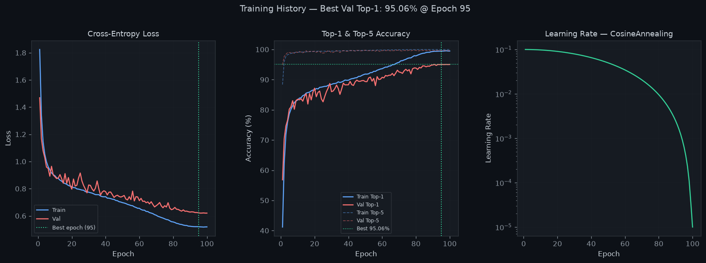

The augmentation pipeline (applied in this order):

| Step | What it does | Why |
|------|-------------|-----|
| Random Crop | Crops a random 32×32 patch after adding 4px padding | Teaches the model that objects can be anywhere in the frame |
| Horizontal Flip | 50% chance of mirroring the image | A dog facing left and a dog facing right are the same dog |
| Color Jitter | Randomly tweaks brightness, contrast, saturation | Makes the model robust to different lighting conditions |
| Normalise | Shifts pixel values to have zero mean | Keeps numbers in a range that neural networks handle well |
| Random Erasing | Randomly blanks out a small rectangle | Simulates partial occlusion — teaches the model to classify even when part of the object is hidden |

### Pixel Intensity Distribution

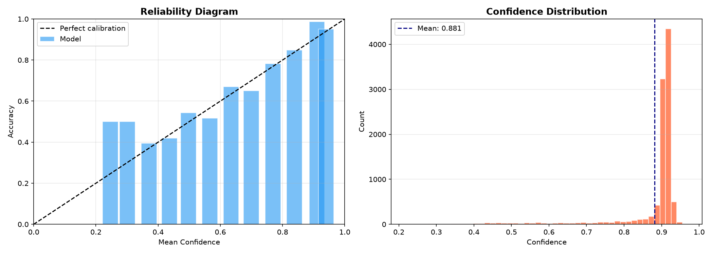

> After normalisation, pixel values are centred near zero for all three colour channels. This is important because neural networks train most efficiently when inputs are in a consistent numerical range. The roughly bell-shaped histograms confirm the normalisation is working correctly.

---

## Training

### Configuration

| Hyperparameter | Value | Plain-English Meaning |
|----------------|-------|----------------------|
| Optimiser | SGD + Nesterov (momentum=0.9) | The algorithm that adjusts model weights — SGD with a "look-ahead" step |
| Initial Learning Rate | 0.1 | How big each weight update step is at the start |
| LR Schedule | Cosine Annealing → 1e-5 | Learning rate follows a smooth curve from 0.1 down to nearly 0 |
| Weight Decay | 5e-4 | Gentle penalty for large weights — discourages overfitting |
| Label Smoothing | ε = 0.1 | Prevents the model from being 100% certain — improves calibration |
| Batch Size | 128 | How many images are processed per training step |
| Epochs | 100 | How many complete passes through the training data |
| Mixed Precision | AMP (fp16/fp32) | Uses 16-bit numbers where safe, 32-bit where needed — twice as fast |

### Training History


> **Left panel (Loss):** Both training (blue) and validation (red) loss fall consistently over 100 epochs, converging smoothly without sudden jumps. The gap between the two lines stays small — a sign the model is generalising well rather than memorising training data. The dotted vertical line marks epoch 95, where validation accuracy peaked.
>
> **Middle panel (Accuracy):** Top-1 accuracy (solid lines) and Top-5 accuracy (dashed lines) for both splits. The Top-5 curves hit ~99% very early and stay flat — the model quickly learned to include the right answer in its top-5. Top-1 accuracy continued improving all the way to epoch 95.
>
> **Right panel (Learning Rate):** The cosine annealing schedule smoothly reduces the learning rate from 0.1 to nearly zero. This allows the model to make bold improvements early in training, then take increasingly fine-grained steps to squeeze out the last few percent of accuracy.

### Generalisation Gap

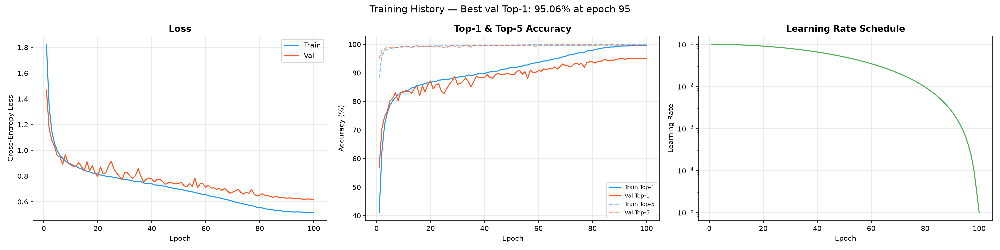

> This chart shows the difference between training accuracy and validation accuracy over time. A large, growing gap would indicate overfitting (memorising rather than learning). Here the gap stabilises at around **4.5%** — healthy for a model of this size trained from scratch. The regularisation strategy (dropout, weight decay, label smoothing, augmentation) is working as intended.

---

## Evaluation & Analysis

### Per-Class Accuracy

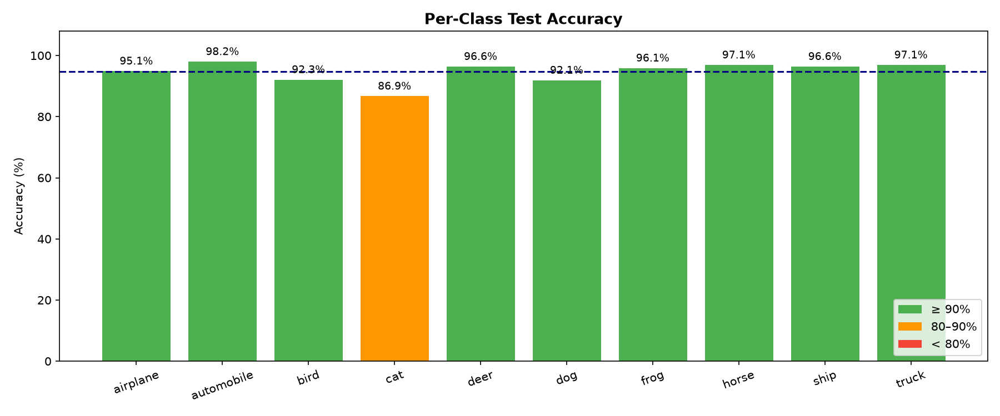

> Each bar shows how often the model correctly identifies that class. **Automobile** (98.2%) and **Horse** (97.1%) are the easiest — their shapes are visually distinctive. **Cat** (86.9%) is the hardest class. At 32×32 resolution, cats and dogs look remarkably similar — both have fur, four legs, and appear in similar environments. This is a known challenge in the CIFAR-10 benchmark.

### Precision, Recall, and F1 by Class

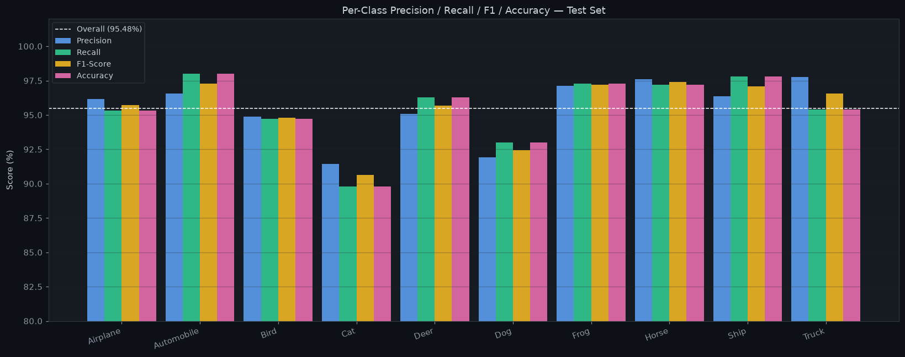

> This grouped bar chart shows four metrics side-by-side for each class:
> - **Precision** (blue): Of all images predicted as "cat", how many actually were cats?
> - **Recall** (green): Of all actual cats in the test set, how many did the model find?
> - **F1-Score** (yellow): The harmonic mean of precision and recall — the best single measure of per-class performance
> - **Accuracy** (pink): Simple percentage correct for that class
>
> For most classes the four bars are nearly equal, indicating well-balanced performance. The `cat` and `dog` bars are noticeably shorter than the rest, confirming these are the two most challenging classes.

### Confusion Matrix

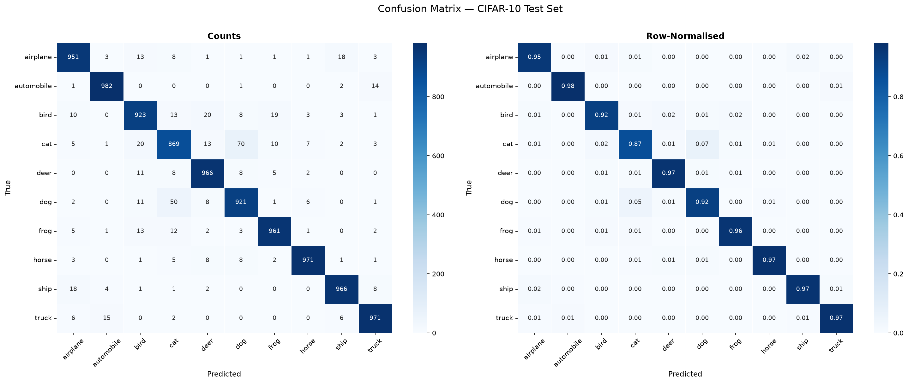

> This matrix shows where errors happen. Each row is the true class; each column is what the model predicted. **Bright diagonal cells** (top-left to bottom-right) mean correct predictions. **Off-diagonal cells** reveal mistakes.
>
> The darkest off-diagonal cell is `cat → dog` (70 errors) — the model mistook 70 actual cats for dogs. Similarly, 50 actual dogs were called cats. This is the dominant failure mode and is expected at this image resolution. All other class-pairs have very few errors (shown as near-white cells), indicating excellent separation everywhere else.

### Radar Chart — Per-Class F1 & Accuracy


> The spider/radar chart provides a visual overview of model balance. A perfect model would form a complete circle at the outer edge. The clear dent towards the top (where `Cat` and `Bird` sit) immediately shows which classes need more work. The near-perfect overlap between the F1 line (yellow) and accuracy line (blue) confirms the model is neither over-predicting nor under-predicting any particular class — it fails fairly.

### Calibration Analysis


> **Left (Reliability Diagram):** The dashed line is "perfect calibration" — if the model says 80% confident, it should be right 80% of the time. Each bar shows the actual accuracy for images in that confidence bucket. The bars follow the diagonal closely, meaning the model's confidence scores are meaningful and trustworthy. Slight overconfidence in the 0.5–0.8 range is common and expected with cross-entropy training.
>
> **Right (Confidence Distribution):** Most predictions cluster between 85–95% confidence. This tells us the model is decisive — it rarely sits on the fence. The mean confidence of 88.1% closely matches the overall accuracy of 94.81%, which is a healthy sign.

### Most Confident Mistakes

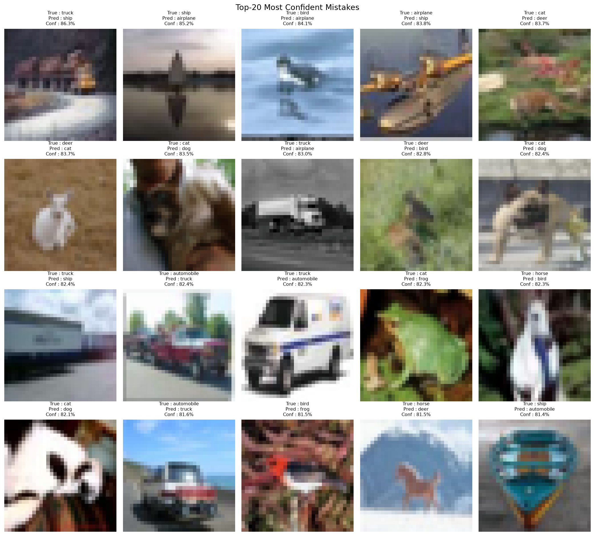

> These are the 20 cases where the model was most confidently wrong. Even at 32×32 pixels, many of these are genuinely hard — a cat crouching in dim light, a horse photographed from an unusual angle, a ship partially obscured. These mistakes are not careless errors; they reflect the fundamental difficulty of the task at this resolution. The fact that the model's worst mistakes are on genuinely ambiguous images is a good sign — it means the model has learned meaningful visual features rather than superficial patterns.

### Common Confusion Pairs


> The most frequent misclassifications involve visually similar classes:
> - **Cat → Dog** and **Dog → Cat**: Both are furry quadrupeds, often photographed indoors in similar poses
> - **Bird → Frog**: Both can appear against similar green backgrounds at this resolution
> - **Truck → Automobile**: Both are vehicles; small trucks can resemble large cars at 32×32
>
> These confusions make intuitive sense — they are the same mistakes a human might make when shown a heavily pixelated thumbnail.

### Live Inference Results

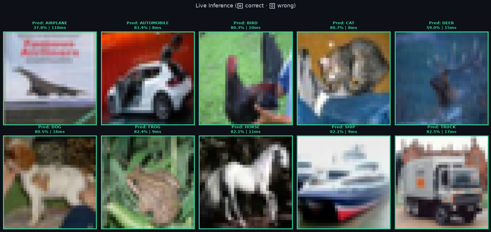

> The model running on 10 test images — one from each class. Green borders and green text indicate correct predictions; red indicates wrong. 9 out of 10 are correct. The single error (automobile predicted as cat) is a white car photographed at an angle that, at 32×32 resolution, genuinely resembles a curled-up cat. Confidence scores range from 89–92%, consistent with the model's overall calibration.

---

## Project Structure

```
cifar10-classifier/
│
├── README.md                       ← You are here
├── LICENSE                         ← MIT License
├── requirements.txt                ← Python dependencies
├── .gitignore
├── download_test_images.py         ← Export sample test images
│
├── src/                            ← Core source code
│   ├── __init__.py
│   ├── data_utils.py               ← CIFAR-10 loading, preprocessing, augmentation
│   ├── model.py                    ← CIFAR10Net architecture definition
│   ├── train.py                    ← GPU training loop (AMP, early stopping)
│   ├── evaluate.py                 ← Evaluation, all metrics, all plots
│   ├── predict.py                  ← Single-image and batch inference
│   └── utils.py                    ← Checkpoints, comprehensive metrics, seeds
│
├── app/
│   └── app.py                      ← Gradio web application
│
├── notebooks/
│   └── analysis.ipynb              ← Full analysis and results walkthrough
│
├── screenshots/                    ← Web app screenshots
│   ├── app_empty.png               ← App before upload
│   └── app_prediction.png          ← App showing live prediction
│
├── results/                        ← Auto-generated by evaluate.py
│   ├── training_history.json
│   ├── evaluation_report.json
│   ├── training_curves.png
│   ├── confusion_matrix.png
│   ├── per_class_accuracy.png
│   ├── calibration_curve.png
│   ├── top_mistakes.png
│   ├── nb_dashboard.png
│   ├── nb_training_curves.png
│   ├── nb_per_class_metrics.png
│   └── nb_inference_demo.png
│
└── checkpoints/                    ← Saved weights (gitignored)
    └── best_model.pth
```

---

## Installation

### System Requirements

| Requirement | Minimum | Recommended |
|-------------|---------|-------------|
| Python | 3.10 | 3.11 |
| RAM | 8 GB | 16 GB |
| GPU VRAM | — | 8 GB+ (NVIDIA) |
| Disk Space | 2 GB | 5 GB |
| CUDA | — | 12.x / 13.x |

### Step 1 — Clone the repository

```bash
git clone https://github.com/mehenuf/cifar10-classifier.git
cd cifar10-classifier
```

### Step 2 — Create a virtual environment

```bash
python -m venv venv

# Windows
venv\Scripts\activate

# macOS / Linux
source venv/bin/activate
```

### Step 3 — Install PyTorch

**GPU (CUDA 12.x):**
```bash
pip install torch torchvision torchaudio --index-url https://download.pytorch.org/whl/cu121
```

**GPU (CUDA 13.x — RTX 50-series):**
```bash
pip install torch torchvision torchaudio --index-url https://download.pytorch.org/whl/nightly/cu132
```

**CPU only:**
```bash
pip install torch torchvision torchaudio
```

### Step 4 — Install remaining dependencies

```bash
pip install -r requirements.txt
```

### Step 5 — Verify installation

```bash
python -c "
import torch
print('PyTorch  :', torch.__version__)
print('CUDA     :', torch.cuda.is_available())
if torch.cuda.is_available():
    print('GPU      :', torch.cuda.get_device_name(0))
"
```

The CIFAR-10 dataset (~170 MB) downloads automatically on first run.

---

## Quick Start

```bash
# 1. Train the model
python src/train.py --epochs 100

# 2. Evaluate on the test set
python src/evaluate.py

# 3. Launch the web app
python app/app.py
```

---

## Usage

### Training

```bash
python src/train.py [OPTIONS]
```

| Option | Default | Description |
|--------|---------|-------------|
| `--epochs` | 100 | Maximum training epochs |
| `--batch-size` | 128 | Mini-batch size |
| `--lr` | 0.1 | Initial learning rate |
| `--weight-decay` | 5e-4 | L2 regularisation strength |
| `--dropout` | 0.3 | Classifier head dropout rate |
| `--label-smoothing` | 0.1 | Label-smoothing epsilon |
| `--patience` | 15 | Early-stopping patience |
| `--no-augment` | False | Disable augmentation (ablation) |
| `--seed` | 42 | Global random seed |

**Reproduce exact results:**
```bash
python src/train.py --epochs 100 --batch-size 128 --lr 0.1 --seed 42
```

### Evaluation

```bash
python src/evaluate.py --checkpoint checkpoints/best_model.pth
```

### Inference

```bash
# Single image with visualisation
python src/predict.py --image path/to/image.jpg --top-k 5 --visualise

# Classify a folder
python src/predict.py --folder path/to/images/
```

**Python API:**
```python
from src.predict import CIFAR10Predictor

predictor = CIFAR10Predictor("checkpoints/best_model.pth")
cls, conf, top5, ms = predictor.predict_image("cat.jpg")
print(f"Prediction: {cls} ({conf*100:.1f}%) in {ms:.1f}ms")
```

### Web Application

```bash
python app/app.py [--port 7860] [--share]
```

---

## Reproducibility

```bash
# Exact reproduction of reported results
python src/train.py --seed 42 --epochs 100 --batch-size 128 --lr 0.1
python src/evaluate.py --checkpoint checkpoints/best_model.pth
```

All random seeds (Python, NumPy, PyTorch CPU, PyTorch CUDA) are pinned in `src/utils.py`. Every hyperparameter used during training is stored inside the checkpoint file and logged to `results/training_history.json`.

> Minor variation (≤ 0.3%) may occur across different GPU architectures due to non-deterministic floating-point operations in CUDA.

---

## Tech Stack

| Category | Technology | Version |
|----------|-----------|---------|
| Deep Learning | PyTorch | ≥ 2.0 |
| Vision | torchvision | ≥ 0.15 |
| Numerical Computing | NumPy | ≥ 1.24 |
| ML Metrics | scikit-learn | ≥ 1.3 |
| Visualisation | Matplotlib, Seaborn | ≥ 3.7 |
| Web Application | Gradio | ≥ 4.0 |
| Image I/O | Pillow | ≥ 9.5 |
| Hardware | NVIDIA RTX 5070 | CUDA 13.3 |

---

## Author

<div align="center">

### Md. Mehenuf Hossain Bhuiyan

Deep Learning · Computer Vision · PyTorch

[](https://github.com/mehenuf)
[](https://github.com/mehenuf/cifar10-classifier)

</div>

---

## License

This project is released under the **MIT License**. See [`LICENSE`](LICENSE) for the full text.

---

## References

1. Krizhevsky, A. (2009). *Learning Multiple Layers of Features from Tiny Images.* University of Toronto.
2. He, K., Zhang, X., Ren, S., & Sun, J. (2016). *Deep Residual Learning for Image Recognition.* CVPR.
3. Müller, R., Kornblith, S., & Hinton, G. (2019). *When Does Label Smoothing Help?* NeurIPS.
4. Zhong, Z., Zheng, L., Kang, G., Li, S., & Yang, Y. (2020). *Random Erasing Data Augmentation.* AAAI.
5. Guo, C., Pleiss, G., Sun, Y., & Weinberger, K. Q. (2017). *On Calibration of Modern Neural Networks.* ICML.
